# Wazuh's Real-Time FIM 

:::info
**Document Creation:** 25 Sept., 2025. **Last Edited:** 10 Sept., 2025. **Authors:** James Pascal-Therios.
:::

## 1. Introduction

When approaching FIM for root files we need to monitor an array of different file types that will give log data on many different fields that are important such as the configuration files belonging in the root of the system.

### 1.1 System Configuration Files

configuration files:

- Users and group information: /etc/passwd, /etc/shadow, /etc/group, /etc/gshadow
- Sudo privileges: /etc/sudoers
- SSH server configuration settings: /etc/ssh/ 
- Filesystem mounts: /etc/fstab
- Network configurations: /etc/hosts and /etc/resolv.conf 
- Kernel: /etc/systctl.conf
- Authentications and access control: /etc/security and /etc/pam.d/

directory /etc
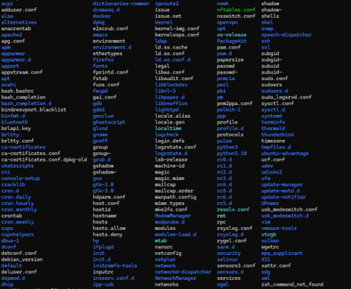

Monitoring of system binaries and libraries is essential to detecting potential malware injections or tampering.

### 1.2 binaries and libraries

- System executables: /bin/, /usr/bin/, /sbin/, /usr/sbin/
- Shared libraries: /lib/, /usr/lib/, /lib64/, /usr/lib64/ 

directory /bin
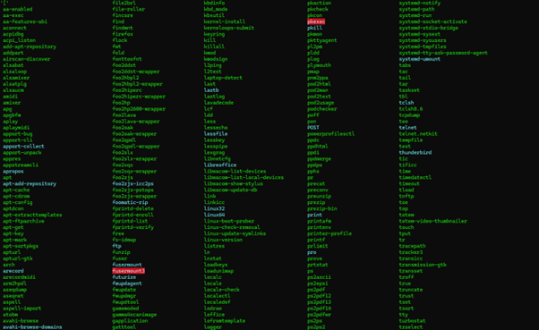

directory /lib
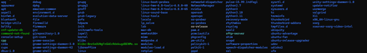

### 1.3 Application configuration files

Monitoring configuration files for crucial applications is a good idea to spot changes that could be detrimental to the system or to bug fix. For web server configurations, they are usually located in the /etc file followed by the name.

- /etc/example_application_name


We could consider adding the wazuh agent into this section to monitor changes to the agent service this is done through the following file path below.

Wazuh agent:
- var/ossec/etc/ossec.conf


### 1.4 Important considerations

- whilst adding real-time monitoring for files are a great way to keep track of activity through the company VM please note that this is a resource intensive process and the more file paths monitored, the more strain this will put on the system.
- As it stands the max limit is currently set to 100,000 files in the scan and although this can be changed it could cause instability and event missing if files exceed this number. 

## 2. Writing Rules

The rules for the FIM for Wazuh reside in the ossec.conf file, which is a part of the wazuh agent service. 
The instillation path is found in **/var/ossec/etc/ossec.conf**

Once in the ossec.conf you can find the appropriate FIM files under the File integrity monitoring tab
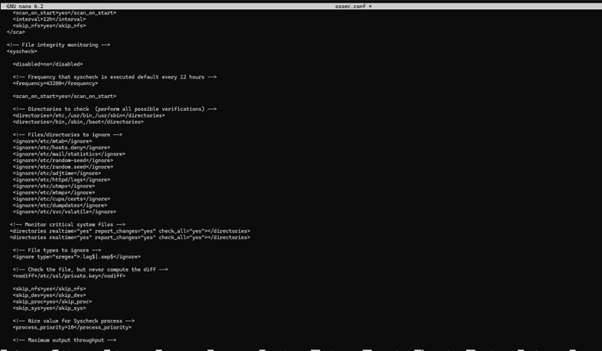

Template of rules


this shows the specification of directories being scanned in real-time and to report all changes. The check_all=”yes” indicates it wants all attributes to be printed to wazuh including sums, size, owner, group, perm, attributes, modification time, and file inode.

To specify the directory that we want checked we close off the first section of the rules and place the file path in the next section as highlighted in the figure below.

directory specification
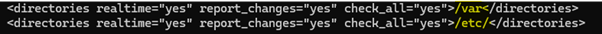


syscheck
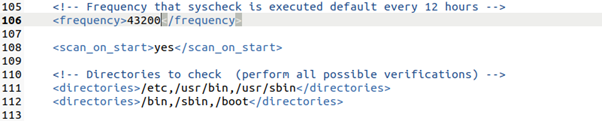

The example above shows a syscheck being conducted every 12 hours. 
If we wanted this more frequent, we could simply change the time parameter.
Line 108 features an option specifying a scan on start which will use the lines below to check the specified directories (/etc,/usr/bin…)

ignoring files
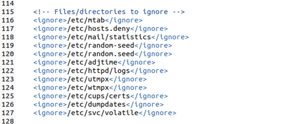
shows the files to be ignored in the syscans specified directories. Here if we wish to not include some of the directories we can input rules using the template above to ignore them and not be sent to wazuh’s dashboard.

### 3.2 Saving changes

The first step to this section is to ensure the agent has received the changes and has saved them to be able to apply them. Make sure any changes to the ossec.conf file has been saved and then restart the wazuh-agent to ensure the changes are applied. 

To restart the agent run the command: 
```
systemctl restart wazuh-agent
```
To check the status of the agent we can use: 
```
systemctl status wazuh-agent
```

**Note:** there are other settings but not all are relevant for the changes being made in this section.


## 3. implementation

To view the changes made we must navigate to Wazuh’s dashboard and look at the FIM section of the specified agent. 
Once on the dashboard you can then navigate to Events to see the real-time logs made. 
The syscheck logs will appear at the specified interval or on startup if that setting had been applied from the ossec.conf.


Events Tab


You can even expand the alerts for additional information
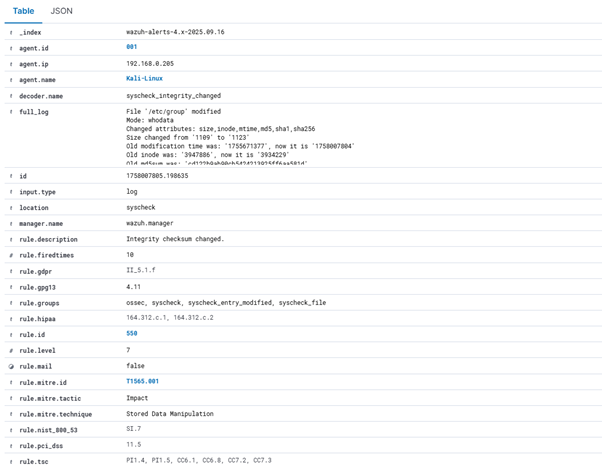

## 3. Intergation of WhoData

In this section we apply and interpret the inclusion of whodata to the new real-time monitoring directories we have added.

Whodata’s audit mode is what we are concerned with in this section, and provides additional information in Wazuh detailing different fields.

The additional information we expect to see upon successful completion entails:
- User id and name (audit.user.id, audit.user.name)
- Login id and name (audit.login_user.id, audit.login_user.name)
- Effective user id and name (audit.effective_user.id, audit.effective_user.name)
- Group ID and name (audit.group.id, audit.group.name)
- Process ID (audit.process.id)
- Process name (audit.process.name)
- Process ppid (audit.process.ppid)

### 3.1 Instillation process

To install whodata we use the following command
```
apt-get install auditd
```

**Note:** If the version being installed is audit 3.1.1 or later then the following plugin is needed.
```
apt-get install audispd-plugins
```

now restart the service.
```
systemctl restart auditd
```

If when we check the rules there exists a certain task under ‘-a never’ then we must delete it. 

This can be checked using the command
```
auditctl -l | grep task
```

now restart both services
```
systemctl restart auditd
systemctl restart wazuh-agent
```

### 3.2 Configuring WhoData

now that it has been installed, we must navigate to the ossec.conf file found typically in the file path /var/ossec/etc/ossec.conf.

in the syscheck block we can now add whodata rules. It should follow the template given below
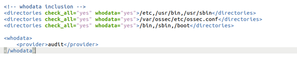

The example above shows the file paths following the same rules as defined the section 2 of the FIM module. The 3 last lines specifies we want to use the audit mode and not the eBPF mode.

Once again restart the wazuh-agent service to solidify the changes using 
```
systemctl restart wazuh-agent
```

Now we can use the below command to check if the audit rule is monitoring the supplied directories
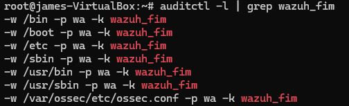

In the example we can see the successful use of the audit rules correctly monitoring the supplied directories 

### 3.3 visualising WhoData

To see the alerts working inside Wazuh we must navigate back to the FIM module on the appropriate agent we used.
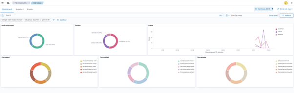

From here we can now click on the events tab to see the logs we have applied the audit rules to. 
Note that they will only appear if alterations are applied, to send the alert in the first place.

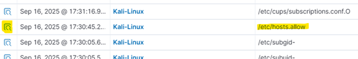
In the above figure we can see the hosts.allow process where we can expand the alert using the highlighted button on the left to see details.

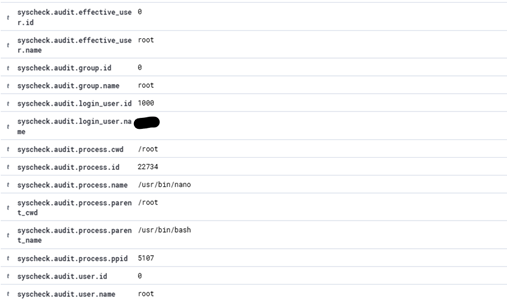
If configured correctly the following results will be shown as per previously specified.

Now the integration has been successfully applied and the alerts in the whodata section will provide additional information on the alerts being thrown in the events tab on Wazuh.


